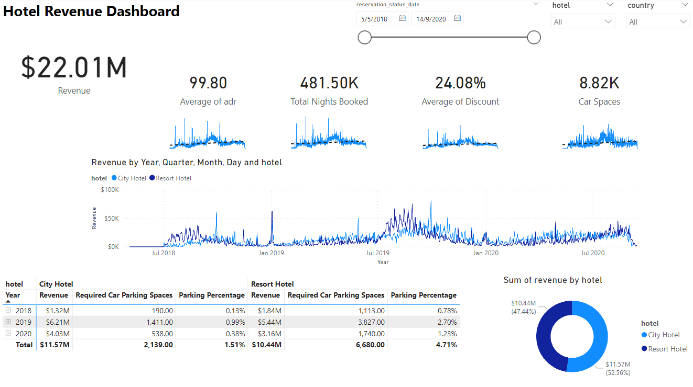
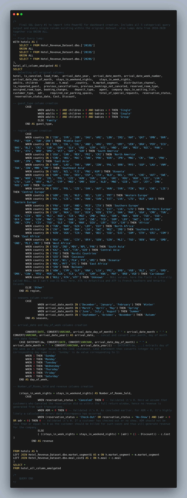
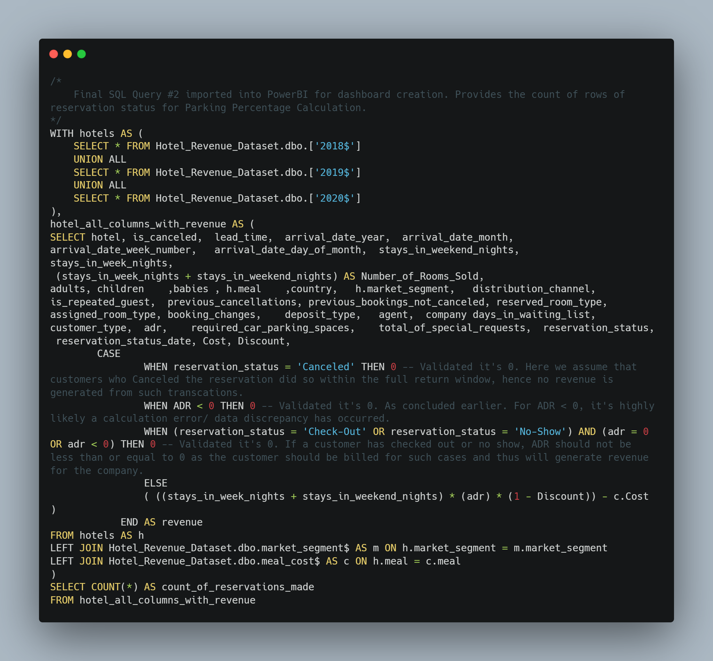
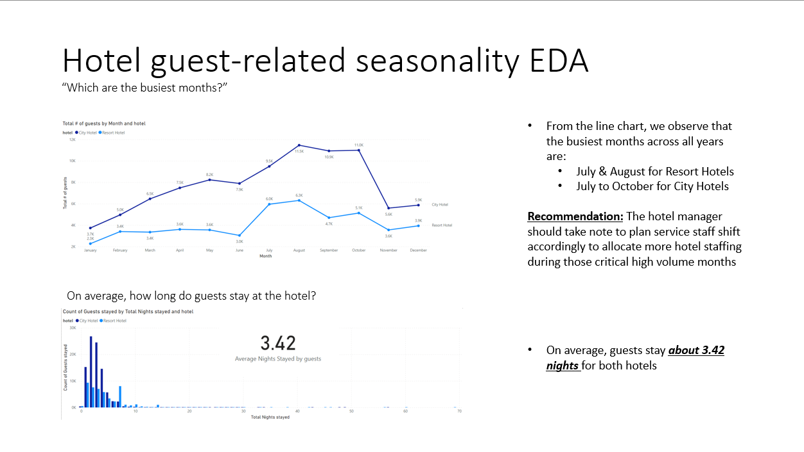
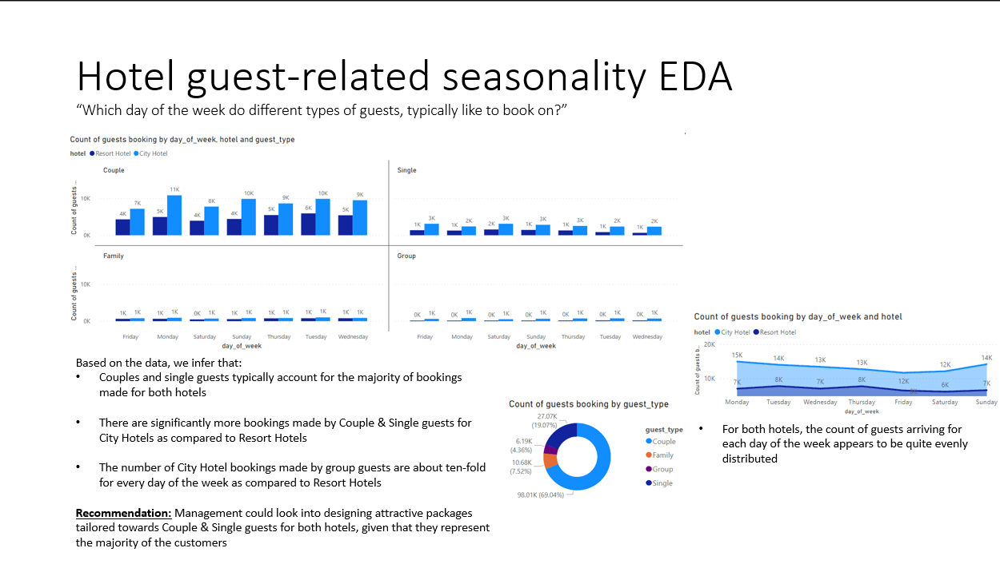
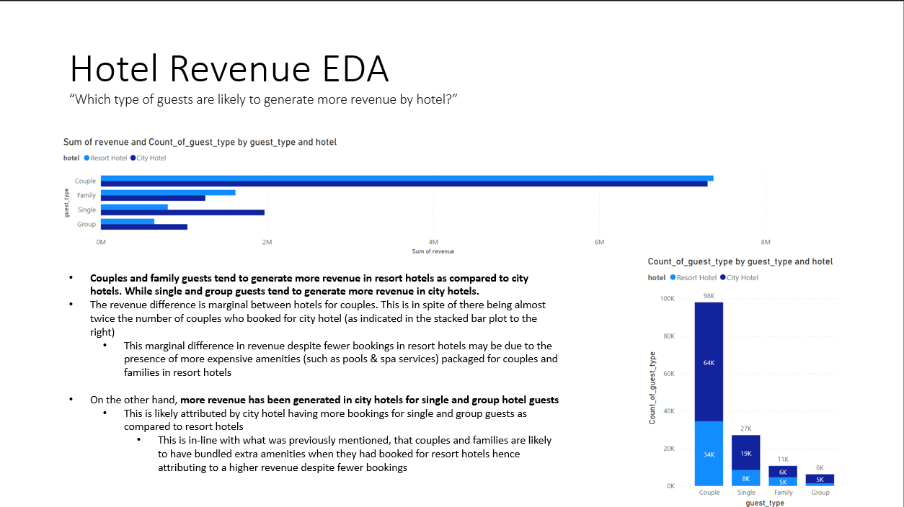
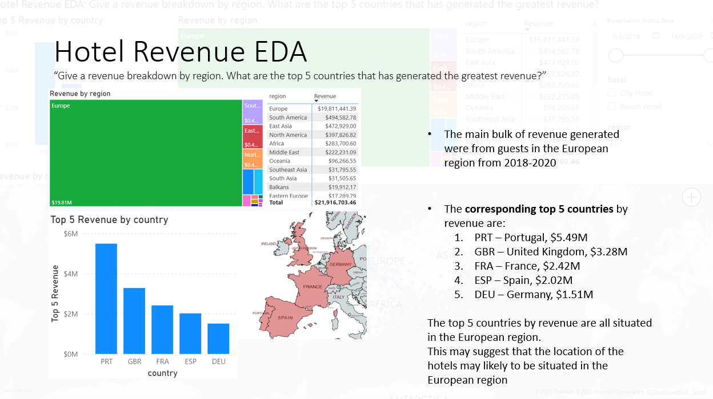
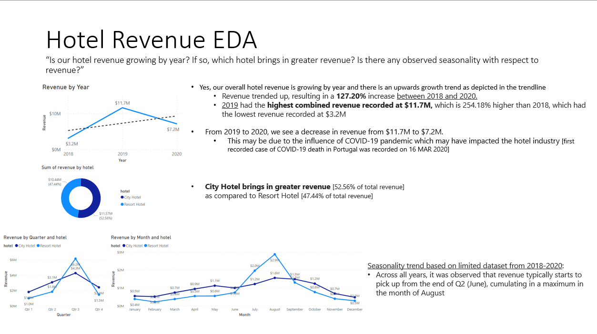

# Hotel Revenue Analysis * [PowerBI, PowerQuery M, T-SQL, SQL Server Management Studio, Excel, PowerPoint] *
[Portfolio Link](https://yattavit.github.io/)

[GitHub Powerpoint link](Hotel_Data_Analysis_Project_GitHub.pdf)  |  [Google Drive PowerPoint Link](https://drive.google.com/file/d/14XPS7B5Y_dRGcqi9oYD5UvCYjVFXmwuw/view?usp=sharing)  |  [GitHub Repository Link](https://github.com/YSPAttavit/Hotel-Revenue-Analysis-Project)

The dataset used in this analysis can be downloaded [here](data/original_data/OriginalDataset_hotel_revenue_historical_full-2.xlsx). It contains various information about hotel booking from 2018 - 2020, along with additional tables containing market segment information and meal costs.

## Power BI Dashboard

The interactive PowerBI Dashboard created for this project can be found in the link below:  
[PowerBI Dashboard Link](https://www.novypro.com/project/hotel-revenue-analysis-dashboard)

## Background
This project explores a hotel revenue dataset spanning across three years (2018, 2019, and 2020). SQL and Power BI were leveraged to uncover valuable insights about revenue & guest seasonality.

Data from raw .csv file was ingested into **SQL Server Management Studio [SSMS]**, from which SQL queries were iteratively built upon to obtain the final SQL output which was then imported into SSMS for data analysis & visualization. Additional data processing was done in **PowerBI** with **PowerQuery M** for visualization purposes. Guests, revenue seasonality, recommendation for staffing arrangement, and dataset limitations were explained in the accompanying **PowerPoint slide** with the help of PowerBI visualizations.

### Final SQL Code Blocks imported into PowerBI

### The project addresses the following key business questions:

**1. Which are the busiest months? On average, how long do guests stay at the hotel?**

**2. Which day of the week do different types of guests, typically like to book on?**

**3. Which type of guests are likely to generate more revenue by hotel?**

**4. What is the revenue breakdown by region? What are the top 5 countries that has generated the greatest revenue?**

**5. Is our hotel revenue growing by year? If so, which hotel brings in greater revenue? Is there any observed seasonality with respect to revenue?**

